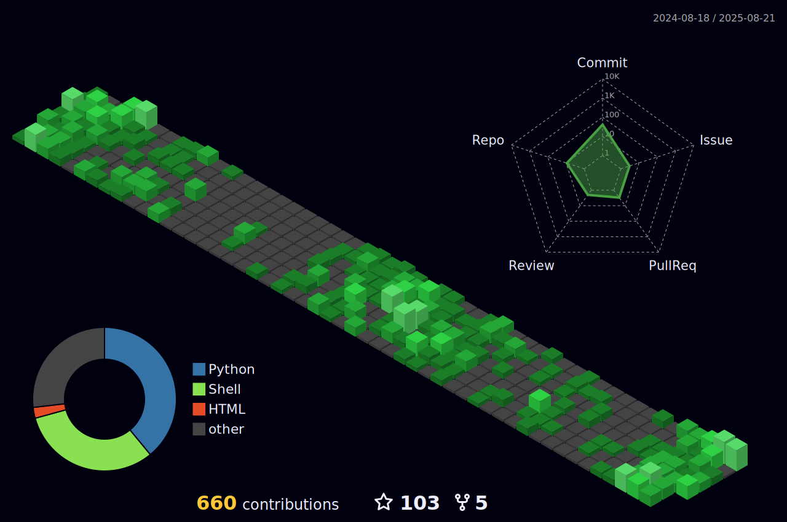

<h3 align="center">
  <a href="https://git.io/typing-svg">
    <!--      -->
    
  </a>
  </h1>

<h2 align="left">Hi there👋, I'm rjun</h1>
<p align="left">A student from Taiwan.</p>

- 🔭 I’m currently studying for a B.S. degree in NCU MIS.
- 💻 I love programming and learn anythings about it.
- 📝 Keep learning C++/Java/Python and Data Structures/Data Science.
- 🌐 Also love web development, learning JavaScript/React/MongoDB.
- 🔫 In adddition to programming, I love FPS games so much.

<h2 align="left">Languages and Tools:</h2>
<p align="left">
  <a href="https://www.cprogramming.com/" target="_blank" rel="noreferrer">
    
  </a>
  <a href="https://www.w3schools.com/cpp/" target="_blank" rel="noreferrer">
    
  </a>
  <a href="https://www.java.com" target="_blank" rel="noreferrer">
    
  </a>
  <a href="https://www.python.org" target="_blank" rel="noreferrer">
    
  </a>
  <a href="https://www.w3.org/html/" target="_blank" rel="noreferrer">
    
  </a>
  <a href="https://www.w3schools.com/css/" target="_blank" rel="noreferrer">
    
  </a>
  <a href="https://developer.mozilla.org/en-US/docs/Web/JavaScript" target="_blank" rel="noreferrer">
    
  </a>
  <a href="https://reactjs.org/" target="_blank" rel="noreferrer">
    
  </a>
  <a href="https://git-scm.com/" target="_blank" rel="noreferrer">
    
  </a>
  <a href="https://www.mongodb.com/" target="_blank" rel="noreferrer">
    
  </a>
  <a href="https://www.mysql.com/" target="_blank" rel="noreferrer">
    
  </a>
</p>

<h2 align="left">GitHub Stats:</h2>

<p>
  &nbsp;
</p>

<p>
  &nbsp;
</p>

<h2 align="left">Coding Stats:</h2>

<!--START_SECTION:waka-->


📊 **This Week I Spent My Time On** 

```text
⌚︎ Time Zone: Asia/Taipei

💬 Programming Languages: 
Markdown                 8 hrs 2 mins        ██████████████░░░░░░░░░░░   57.53% 
C++                      2 hrs 55 mins       █████░░░░░░░░░░░░░░░░░░░░   20.92% 
Python                   1 hr 29 mins        ██░░░░░░░░░░░░░░░░░░░░░░░   10.68% 
JavaScript               39 mins             █░░░░░░░░░░░░░░░░░░░░░░░░   4.75% 
Java                     22 mins             ░░░░░░░░░░░░░░░░░░░░░░░░░   2.65%

🔥 Editors: 
VS Code                  12 hrs 49 mins      ███████████████████████░░   91.73% 
WebStorm                 46 mins             █░░░░░░░░░░░░░░░░░░░░░░░░   5.57% 
IntelliJ                 22 mins             ░░░░░░░░░░░░░░░░░░░░░░░░░   2.69%

💻 Operating System: 
Windows                  11 hrs 1 min        ███████████████████░░░░░░   78.87% 
Mac                      2 hrs 57 mins       █████░░░░░░░░░░░░░░░░░░░░   21.13%

```


 Last Updated on 27/10/2022 17:08:47 UTC
<!--END_SECTION:waka-->


<h2 align="left">Metrics</h2>



<h2 align="left">Connect with me:</h2>
<p align="left">
  <a href="https://linkedin.com/in/lean-tzou"
    target="blank"></a>
  <a href="https://www.leetcode.com/xxrjun"
    target="blank"></a>
</p>
